# Лабораторная работа №2
## Облачные вычислительные сервисы. Amazon EC2

**Студент:** Mihailovschi Egor 
**Группа:** IA2404  
**Специальность:** Informatica Aplicata  
**Уровень:** базовый, задания 1–6  
**Дата выполнения:** 01.10.2026  
**Регион AWS:** Europe (Frankfurt), `eu-central-1`  


## 1. Цель работы

Цель лабораторной работы — получить практические навыки работы с виртуальными машинами Amazon EC2: подготовить IAM-доступ и бюджет, запустить экземпляр Amazon Linux 2023, настроить nginx с помощью User data, проверить состояние виртуальной машины, подключиться по SSH и разместить на сервере статический веб-сайт.

## 2. Использованные ресурсы

| Параметр | Значение |
|---|---|
| Облачная платформа | Amazon Web Services |
| Сервис | Amazon EC2 |
| Регион | `eu-central-1` — Europe (Frankfurt) |
| Образ | Amazon Linux 2023 |
| Тип экземпляра | `t3.micro` |
| Имя экземпляра | `webserver` |
| Веб-сервер | nginx |
| Протокол доступа | SSH |
| Порт веб-сервера | TCP 80 |
| Порт SSH | TCP 22 |
| Пользователь Linux | `ec2-user` |
| Бюджет | `My Zero-Spend Budget`, порог $1.00 |

## 3. Подготовка AWS-аккаунта

### 3.1. IAM-пользователь

Для работы был создан IAM-пользователь `cloudstudent`, добавленный в группу `Admins`. Группе назначена политика `AdministratorAccess`.

Политика `AdministratorAccess` предоставляет полный доступ к сервисам и ресурсам AWS через консоль и API. В учебной лабораторной она позволяет выполнять необходимые операции с IAM, EC2, VPC, CloudWatch и Billing.

Root-пользователь не следует использовать для повседневной работы, потому что он обладает неограниченными правами на весь AWS-аккаунт. Ошибка или компрометация root-учётной записи может привести к изменению или удалению любых ресурсов. Для обычной работы безопаснее использовать IAM-пользователя с необходимыми правами и включённой MFA.

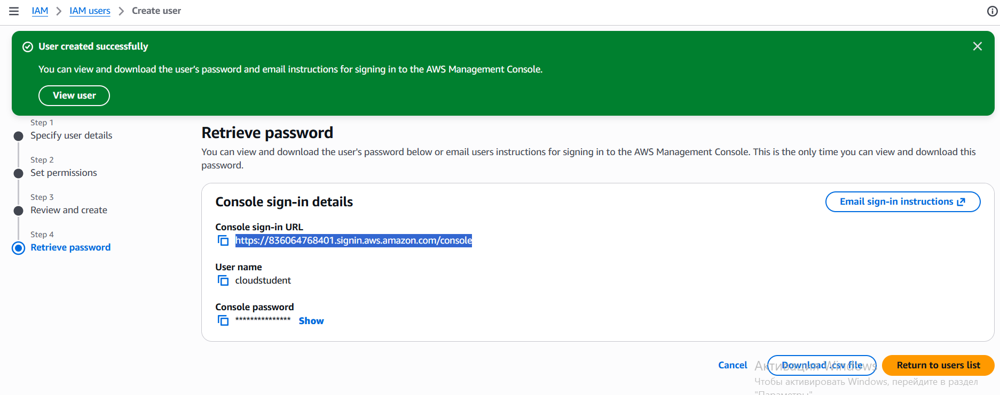

### 3.2. Бюджет

В AWS Budgets был создан бюджет `My Zero-Spend Budget` с порогом `$1.00` и email-уведомлением. В момент выполнения работы фактическая сумма расходов составляла `$0.00`, состояние бюджета — `Healthy`, состояние порога — `OK`.

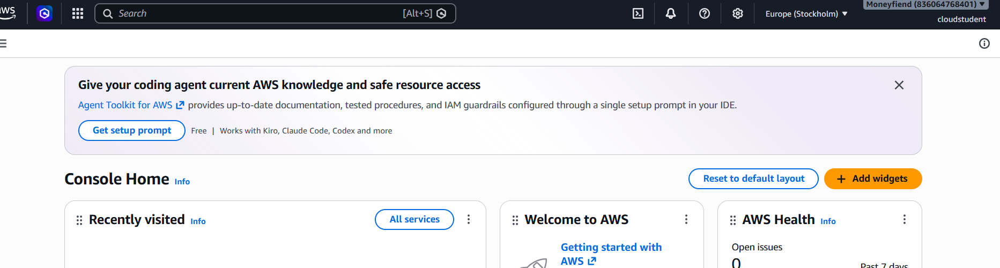

Email-подписка была подтверждена: в деталях бюджета отображается `1/1 email verified`.

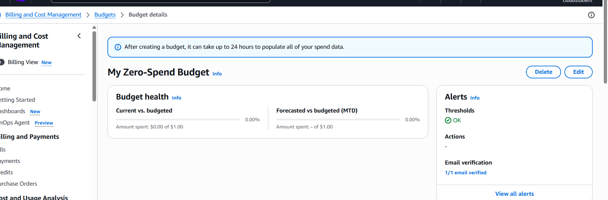

## 4. Запуск экземпляра EC2

Был создан экземпляр EC2 со следующими параметрами:

- имя: `webserver`;
- образ: Amazon Linux 2023;
- тип: `t3.micro`;
- регион: `eu-central-1`;
- публичный IPv4-адрес включён;
- создана пара SSH-ключей ED25519 в формате `.pem`;
- создана Security Group с правилами SSH и HTTP.

Для SSH был разрешён доступ только с текущего IP-адреса пользователя. Для HTTP был открыт порт 80 для всех IPv4-адресов, чтобы веб-страница была доступна из интернета.

### User data

При запуске экземпляра использовался скрипт:

```bash
#!/bin/bash
dnf -y update
dnf -y install htop nginx
systemctl enable --now nginx
```

User data — это скрипт первоначальной настройки экземпляра, который выполняется механизмом cloud-init во время первого запуска. В данном случае он обновляет пакеты, устанавливает `htop` и nginx, запускает nginx и добавляет его в автозапуск.

Скрипт User data обычно не выполняется повторно после обычной перезагрузки. Однако nginx будет запущен автоматически, потому что для него выполнена команда `systemctl enable`.

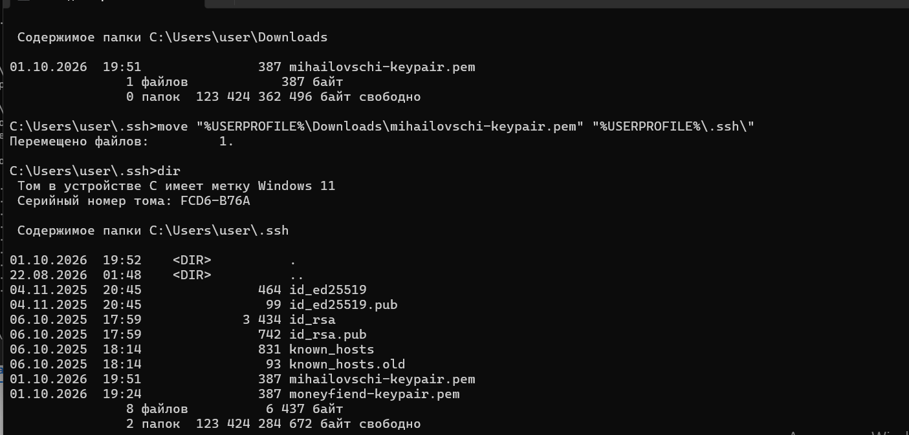

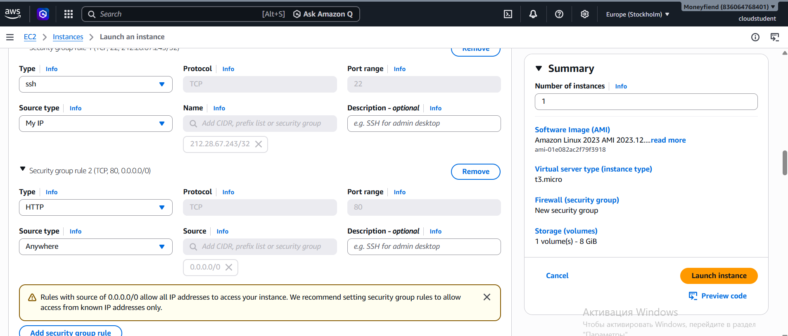

## 5. Проверка состояния и диагностика

После запуска экземпляр перешёл в состояние `Running`. Проверки `System status`, `Instance status` и `EBS status` завершились успешно.

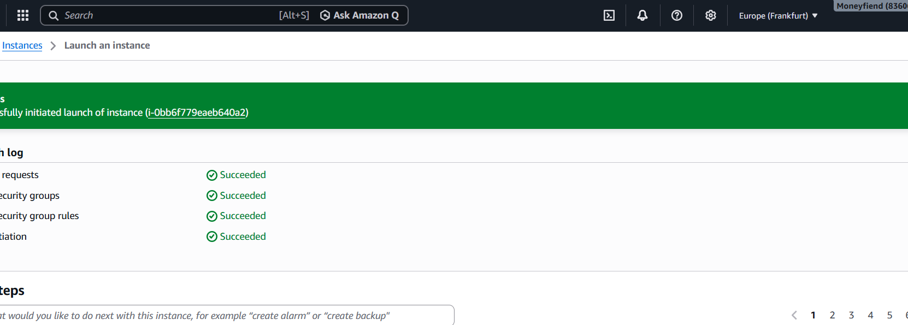
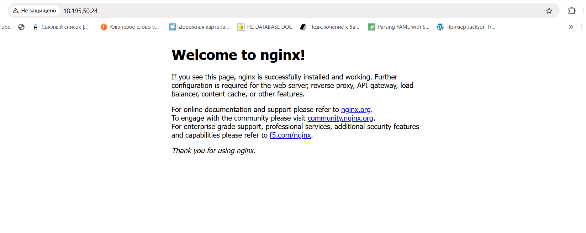

### Status checks

- **System status check** проверяет инфраструктуру AWS: физический сервер, сеть и гипервизор. Ошибка этой проверки обычно указывает на проблему на стороне AWS.
- **Instance status check** проверяет операционную систему и способность виртуальной машины отвечать. Такая проблема может быть вызвана настройками или программами внутри экземпляра.
- **EBS status check** проверяет доступность подключённого диска EBS.

Таким образом, system status check в основном относится к инфраструктуре AWS, а instance status check — к самой виртуальной машине и её операционной системе.
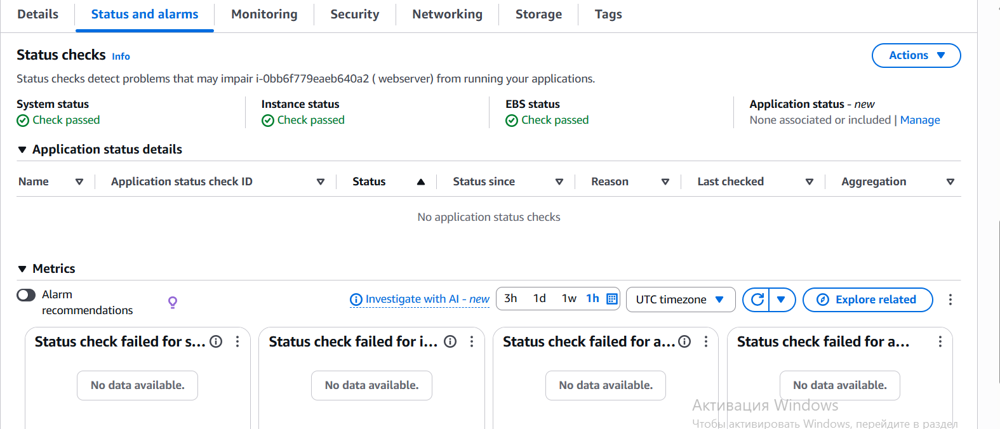

### Monitoring

На вкладке Monitoring отображаются метрики CloudWatch: загрузка CPU, сетевой трафик, сетевые пакеты и использование CPU-кредитов. Для учебной работы достаточно базового мониторинга. Детальный мониторинг имеет смысл включать в production-системах, когда нужна более частая информация о нагрузке и быстрая реакция на проблемы. Для лабораторной он не требуется, так как может увеличить расходы.

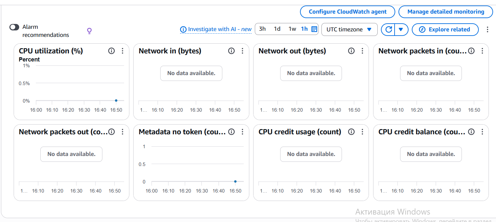

### System log

В System log были найдены записи cloud-init об установке пакетов `htop` и `nginx`. Это подтверждает, что User data был передан экземпляру и выполнен.

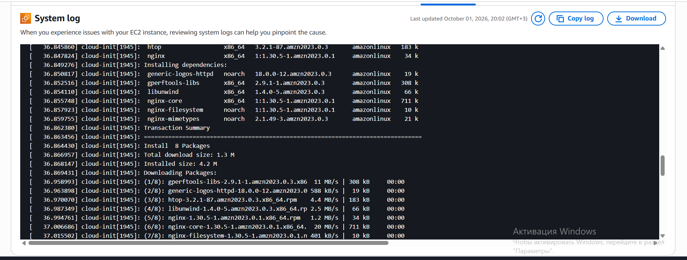

### Instance screenshot

Instance screenshot показывает, что система Amazon Linux 2023 успешно загрузилась.

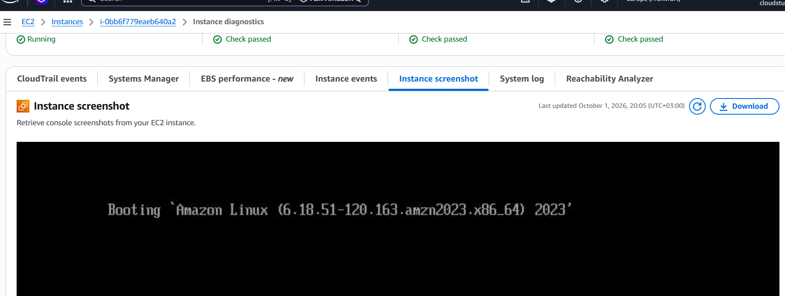

## 6. Подключение по SSH

Для подключения использовался пользователь `ec2-user` и приватный ключ `.pem`:

```powershell
ssh -i $HOME\.ssh\mihailovschi-keypair.pem ec2-user@<Public-IP>
```

В Windows PowerShell переменная `$HOME` указывает на домашнюю папку пользователя. Приватный ключ был сохранён в каталоге `.ssh`.

После подключения была выполнена проверка:

```bash
systemctl status nginx
```

Сервис nginx находился в состоянии:

```text
Active: active (running)
```

### Почему используется ключ, а не пароль?

Для Linux-экземпляра EC2 используется SSH-аутентификация по паре ключей. Публичный ключ помещается в экземпляр, а приватный `.pem` остаётся у владельца. Во время подключения SSH проверяет соответствие ключей, не передавая приватный ключ серверу. Такой подход устойчивее к подбору паролей и удобен для автоматизации. Пользователь `ec2-user` в Amazon Linux обычно не использует обычный пароль для SSH-входа.

## 7. Развёртывание статического сайта

На локальном компьютере были созданы три HTML-файла:

- `index.html` — главная страница;
- `about.html` — страница «О нас»;
- `contact.html` — страница «Контакты».

Страницы содержат ссылки друг на друга. Для передачи файлов на сервер была использована команда:

```powershell
scp -i $HOME\.ssh\mihailovschi-keypair.pem index.html about.html contact.html ec2-user@<Public-IP>:~
```

После копирования на сервере выполнены команды:

```bash
sudo cp ~/*.html /usr/share/nginx/html/
ls -l /usr/share/nginx/html
```

Команда `scp` безопасно копирует файлы поверх SSH. Она похожа на `ssh`, потому что использует тот же защищённый канал и механизм аутентификации, но предназначена для передачи файлов, а не для интерактивного выполнения команд.

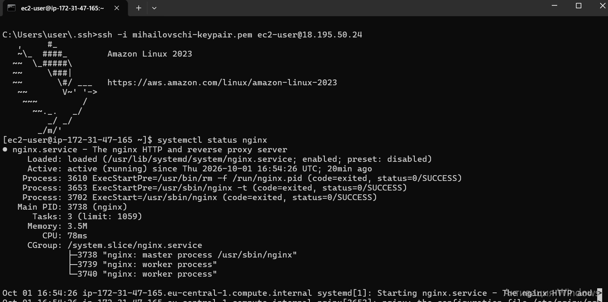

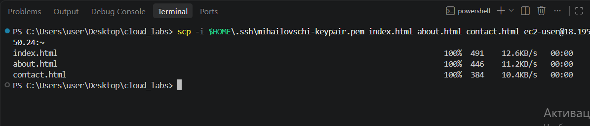

После копирования сайт был доступен по адресу:

```text
http://<Public-IP>
```
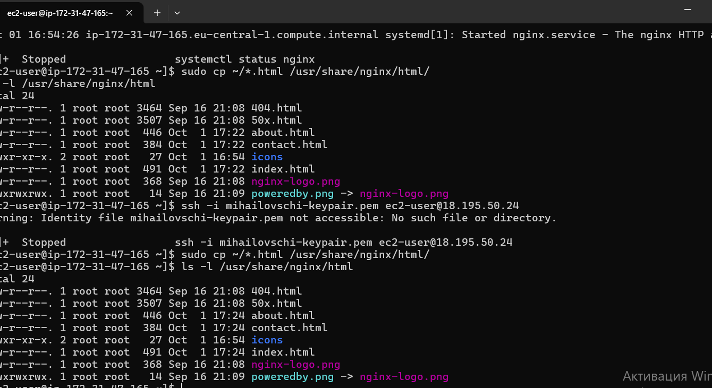
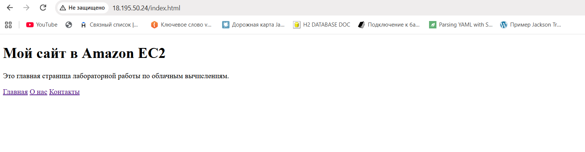

Страница открывается через nginx, а ссылки «Главная», «О нас» и «Контакты» ведут на соответствующие HTML-файлы.

## 8. Остановка экземпляра через AWS CLI

Для остановки был использован AWS CloudShell, в котором AWS CLI уже настроен для текущего пользователя:

```bash
aws ec2 stop-instances \
  --instance-ids <INSTANCE_ID> \
  --region eu-central-1
```

Команда вернула состояние экземпляра `stopping`, после чего экземпляр перешёл в `stopped`.

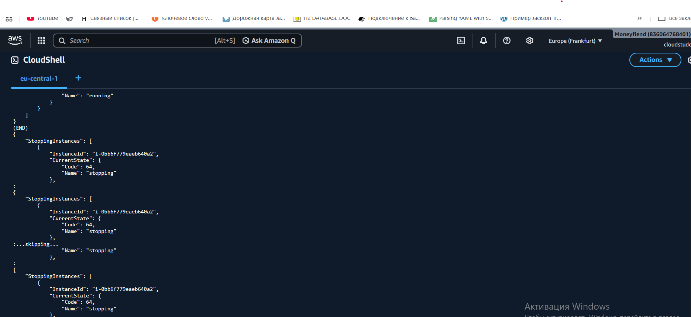

### Разница между Stop и Terminate

`Stop` выключает виртуальную машину, но сохраняет экземпляр, его настройки и EBS-диск. После этого его можно снова запустить. Вычислительные ресурсы EC2 при остановке обычно не оплачиваются, но оплата EBS-диска и некоторых других ресурсов может продолжаться.

`Terminate` удаляет экземпляр. Root EBS-том обычно также удаляется, если включена настройка удаления при завершении. Поэтому после `Terminate` данные на диске можно потерять.

# Часть 2. Продвинутый уровень

## Архитектура приложения

Для развёртывания выбрано учебное приложение TimeCapsule из каталога `open_capsules_php_functional`. Это монолитное PHP-приложение: веб-сервер, PHP-код, PostgreSQL и локальное файловое хранилище расположены на одном экземпляре EC2.

Путь запроса:

```text
Браузер
  │ HTTP, TCP 80
  ▼
nginx
  ├── статические файлы: CSS, JavaScript, изображения
  ▼ FastCGI / Unix socket /run/php-fpm/www.sock
PHP-FPM
  ▼
TimeCapsule (PHP)
  ├── SQL, localhost:5432 → PostgreSQL 16
  └── файлы и сессии → storage/uploads
```

Nginx принимает HTTP-запросы и быстро отдаёт статические файлы. PHP-код nginx самостоятельно не выполняет: PHP-запросы передаются PHP-FPM через Unix socket `/run/php-fpm/www.sock`. PHP-приложение обращается к PostgreSQL только локально, на `localhost:5432`; порт базы данных не открывается в Security Group и недоступен из интернета.

---

## Задание 7. GitHub Organization и репозиторий

Была создана GitHub Organization:

```text
mihailovschi-cloud
```

Внутри организации создан публичный репозиторий:

```text
timecapsule
```

Адрес репозитория:

```text
https://github.com/mihailovschi-cloud/timecapsule
```

В корне репозитория находятся файлы и папки выбранного приложения:

```text
.env.example
.gitignore
bin/
composer.json
composer.lock
public/
src/
storage/
views/
```

Файл `composer.json` находится непосредственно в корне репозитория, поэтому приложение можно установить командой `composer install` без перехода во вложенную подпапку.

<!-- ВСТАВИТЬ СКРИНШОТ 16: GitHub-репозиторий mihailovschi-cloud/timecapsule, Public, в корне видны public, src, views и composer.json. Например: images/advanced-github-repository.jpg -->

### Ответ: почему `.env` и `vendor/` не попали в Git

Файл `.env` исключён правилами `.gitignore`, потому что содержит параметры конкретного окружения и секретные данные: в частности, пароль PostgreSQL. В публичном репозитории хранится только `.env.example` без настоящих секретов.

Папка `vendor/` также исключена `.gitignore`, потому что содержит внешние PHP-библиотеки Composer. Она создаётся командой `composer install` на основе файлов `composer.json` и `composer.lock`. Благодаря этому репозиторий не содержит копии зависимостей и остаётся компактнее, а сервер устанавливает фиксированные версии библиотек.

---

## Задание 8. Подготовка сервера

Так как первоначальный экземпляр из базовой части был удалён после выполнения заданий, для продвинутой части был создан новый экземпляр `webserver` в регионе `eu-central-1`. После запуска был получен новый публичный IPv4-адрес и выполнено SSH-подключение.

На сервер были установлены Git, Composer, PostgreSQL 16, PHP-FPM и расширения PHP:

```bash
sudo dnf -y install git composer postgresql16-server \
    php8.4-fpm php8.4-cli php8.4-pgsql php8.4-mbstring php8.4-xml
```

Проверка показала, что PHP видит драйвер PostgreSQL:

```bash
php -v
php -m | grep pdo_pgsql
composer --version
git --version
```

В результате была установлена PHP 8.4, а команда `php -m | grep pdo_pgsql` вернула `pdo_pgsql`.


SSH и systemctl status nginx, Active: active (running)


### Ответ: почему пакеты устанавливались вручную

Пакеты устанавливались вручную, а не через User data, потому что User data в базовой части предназначался для простой начальной настройки nginx. Установка большого числа компонентов через один сценарий осложняет диагностику: если шаг не сработал, труднее определить причину и повторить только нужную операцию. Ручная установка позволила поэтапно проверить PHP, Composer, Git и PostgreSQL.

---

## Задание 9. PostgreSQL

Сначала была выполнена инициализация PostgreSQL:

```bash
sudo postgresql-setup --initdb
```

Для просмотра правил подключений использовалась команда:

```bash
sudo grep -v '^#' /var/lib/pgsql/data/pg_hba.conf | grep -v '^$'
```

Для локальных TCP-подключений метод аутентификации `ident` был заменён на `scram-sha-256`:

```bash
sudo sed -i 's/ident$/scram-sha-256/' /var/lib/pgsql/data/pg_hba.conf
```

Затем PostgreSQL был включён в автозапуск и запущен:

```bash
sudo systemctl enable --now postgresql
```

Для приложения созданы отдельные пользователь и база данных:

```bash
sudo -u postgres psql -c "CREATE USER timecapsule WITH PASSWORD '***';"
sudo -u postgres psql -c "CREATE DATABASE timecapsule OWNER timecapsule;"
```

Работа парольного подключения была подтверждена:

```bash
psql -h localhost -U timecapsule -d timecapsule -c "SELECT 1;"
```

определяет, кто, откуда и каким способом может подключаться к PostgreSQL


psql -h localhost -U timecapsule -d timecapsule -c "SELECT 1;

### Объяснение pg_hba.conf

Файл `pg_hba.conf` определяет, кто, откуда и каким способом может подключаться к PostgreSQL. Метод `ident` требует соответствия имени пользователя Linux имени пользователя базы. Это не подходит приложению, которое подключается как `timecapsule` с отдельным паролем.

Метод `scram-sha-256` реализует современную парольную аутентификацию. PostgreSQL принимает подключение от `localhost`, проверяет имя пользователя и пароль; сама база не доступна напрямую из интернета.

---

## Задание 10. Развёртывание кода и настройка окружения

Для приложения была создана директория на сервере:

```bash
sudo mkdir -p /var/www/timecapsule
sudo chown ec2-user:ec2-user /var/www/timecapsule
```

Публичный репозиторий был клонирован через HTTPS:

```bash
git clone https://github.com/mihailovschi-cloud/timecapsule.git /var/www/timecapsule
cd /var/www/timecapsule
ls -la
```

HTTPS использован потому, что публичный репозиторий доступен на чтение без ключей и токенов. Сервер получает код, но не имеет учётных данных, позволяющих отправить изменение обратно в GitHub.

На сервере был создан файл `.env` с параметрами окружения. В отчёте не приводится его содержимое, потому что он содержит пароль базы данных.

```ini
APP_URL=http://<PUBLIC-IP>
APP_DEBUG=false

DB_HOST=localhost
DB_PORT=5432
DB_NAME=timecapsule
DB_USER=timecapsule
DB_PASSWORD=***

UPLOAD_DIR=storage/uploads
MAX_UPLOAD_MB=5
MAIL_DELAY_SECONDS=3
AUTH_ENABLED=true
```

Права были настроены следующим образом:

```bash
chmod 640 .env
sudo chgrp apache .env
sudo chown -R apache:apache storage
```

Затем были установлены зависимости и подготовлена структура базы данных:

```bash
composer install --no-dev --optimize-autoloader
php bin/init-db.php
```

Скрипт вернул сообщение `Database is ready`.


git clone/ls -la в /var/www/timecapsule


права .env и storage


composer install и php bin/init-db.php с Database is ready

### Ответ: `.env`, публичный репозиторий и безопасность

Пароль базы данных хранится в `.env` на сервере, а не в исходном коде, чтобы он не оказался в истории Git и публичном репозитории. `.env` исключён в `.gitignore`, поэтому `git pull` его не затрагивает и Git не отправляет его на GitHub.

Публичный репозиторий безопасен для этого приложения, потому что он содержит исходный код, `.env.example` без секретов и описание зависимостей. Реальные пароли, текущий public IP и настройки конкретного сервера существуют только в `.env` на EC2.

---

## Задание 11. Настройка PHP-FPM и nginx

Для разрешения загрузки файлов до 5 MB PHP-лимит был увеличен до 6 MB:

```bash
sudo sed -i 's/^upload_max_filesize.*/upload_max_filesize = 6M/' /etc/php.ini
```

Была создана конфигурация `/etc/nginx/conf.d/timecapsule.conf`:

```nginx
server {
    listen 80 default_server;
    listen [::]:80 default_server;

    root /var/www/timecapsule/public;
    index index.php;

    client_max_body_size 8M;

    location / {
        try_files $uri /index.php?$query_string;
    }

    location ~ \.php$ {
        try_files $uri =404;
        fastcgi_pass unix:/run/php-fpm/www.sock;
        include fastcgi_params;
        fastcgi_param SCRIPT_FILENAME $document_root$fastcgi_script_name;
    }

    location ~ /\. {
        deny all;
    }
}
```

Перед перезапуском была выполнена проверка конфигурации:

```bash
sudo nginx -t
```

После успешной проверки были запущены PHP-FPM и nginx:

```bash
sudo systemctl enable --now php-fpm
sudo systemctl restart nginx
```

Приложение стало доступно по публичному адресу EC2. Endpoint `/health` вернул JSON со статусами приложения и базы данных.


sudo nginx -t, syntax is ok/test is successful


страница входа TimeCapsule в браузере

/health с "status":"ok" и "db":"ok"

### Назначение директив nginx

| Директива | Назначение |
|---|---|
| `listen 80 default_server;` | Принимать HTTP-запросы на TCP-порту 80 как сайт по умолчанию |
| `root /var/www/timecapsule/public;` | Открыть наружу только публичную папку приложения |
| `index index.php;` | Выполнять `index.php`, если запрошен корневой URL `/` |
| `client_max_body_size 8M;` | Разрешить HTTP-запросы/загрузки размером до 8 MB |
| `try_files $uri /index.php?$query_string;` | Отдать существующий файл или передать маршрут front controller `index.php` |
| `location ~ \.php$` | Обрабатывать PHP-запросы |
| `fastcgi_pass unix:/run/php-fpm/www.sock;` | Передавать PHP-запрос в PHP-FPM по Unix socket |
| `fastcgi_param SCRIPT_FILENAME ...` | Передать PHP-FPM полный путь к выполняемому скрипту |
| `location ~ /\. { deny all; }` | Запретить доступ к скрытым файлам, например `.env` и `.git` |

---

## Задание 12. Ручное обновление приложения

Так как специальность — **Informatică aplicată**, выбран вариант A: ручной деплой без скрипта `deploy.sh`.

После `git push` с локального компьютера на сервере вручную выполнялась последовательность:

```bash
cd /var/www/timecapsule
git pull
composer install --no-dev --optimize-autoloader
php bin/init-db.php
sudo systemctl reload php-fpm
```

Назначение этапов:

1. `git pull` получает новую версию исходного кода из GitHub.
2. `composer install` приводит папку `vendor` к версиям, указанным в `composer.lock`.
3. `php bin/init-db.php` создаёт недостающие таблицы, если новая версия их требует.
4. `systemctl reload php-fpm` перезагружает рабочие PHP-процессы без остановки nginx.

ручной деплой — git pull, composer install, Database is ready, reload php-fpm

### Ответ: риск во время git pull

`git pull` обновляет файлы не атомарно: они заменяются последовательно. Посетитель, который откроет сайт в короткий момент обновления, теоретически может получить смешанную версию приложения, ошибку 500, 404 или страницу с несовместимыми частями кода.

Если после `git pull` не выполнить `composer install`, новая версия может использовать класс или библиотеку, отсутствующую в текущей `vendor`. В результате приложение может завершиться ошибкой, например `Class not found`.

---

## Задание 13. Новая версия, ошибка и откат

### Проверка приложения

Перед выпуском новой версии был зарегистрирован пользователь и создана капсула с датой открытия в будущем. Это позволило проверить, что данные PostgreSQL и пользовательские файлы не пропадают после обновления исходного кода.

созданная капсула в списке пользователя

### Выпуск рабочей версии

В локальный файл `views/layout.php` была добавлена подпись автора в footer. Изменение было добавлено в Git и отправлено в репозиторий:

```bash
git add views/layout.php
git commit -m "Show author in footer"
git push
```

На EC2 был выполнен ручной деплой. После обновления подпись автора появилась в приложении, при этом созданная ранее капсула сохранилась.


страница TimeCapsule с видимой подписью автора в footer

### Намеренная поломка

Для проверки механизма отката в конец `views/layout.php` локально была добавлена синтаксическая ошибка:

```php
<?php broken(
```

Изменение было закоммичено и отправлено:

```bash
git add views/layout.php
git commit -m "Introduce syntax error for rollback test"
git push
```

После ручного деплоя главная страница начала возвращать ошибку `500 Internal Server Error`.

ошибка 500 после деплоя версии с синтаксической ошибкой

Endpoint `/health` был проверен отдельно. Он проверяет доступность отдельного маршрута приложения и соединение с базой данных, но не является полной проверкой всех пользовательских сценариев и шаблонов.


фактический ответ /health после поломки

### Откат версии

Файл не исправлялся вручную на EC2. Исправление было создано через Git в локальном репозитории:

```bash
git revert --no-edit HEAD
git push
```

После отправки revert-коммита на EC2 был снова выполнен ручной деплой:

```bash
cd /var/www/timecapsule
git pull
composer install --no-dev --optimize-autoloader
php bin/init-db.php
sudo systemctl reload php-fpm
```

Главная страница снова стала доступна, подпись автора осталась, а созданная ранее капсула не исчезла.

git revert --no-edit HEAD и git push в локальном терминале

успешный финальный ручной деплой после revert

восстановленная главная страница с подписью автора

### Ответ: почему `/health` может вернуть ok, когда главная страница не работает

Маршрут `/health` обычно выполняет отдельную простую проверку приложения и подключения к базе данных. Он может не использовать общий HTML-шаблон `views/layout.php`, содержащий синтаксическую ошибку. Поэтому его успешный ответ означает, что процесс PHP и PostgreSQL доступны, но не гарантирует исправность главной страницы, авторизации, шаблонов, загрузки файлов и других пользовательских сценариев.

Для более полной проверки нужны smoke-тесты: открытие главной страницы, вход, создание капсулы, загрузка вложения и проверка ключевых HTTP-ответов.

### Ответ: время простоя и его сокращение

Сайт был недоступен с момента ручного деплоя версии с синтаксической ошибкой до завершения `git revert`, `git push` и повторного ручного деплоя. В это время входили обнаружение ошибки, проверка `/health`, создание revert-коммита, доставка исправления в GitHub, получение его на EC2 и перезагрузка PHP-FPM.

Время простоя можно сократить автоматическими тестами до деплоя, staging-окружением, автоматическим health/smoke-тестом после развёртывания, быстрым автоматическим rollback и стратегиями blue-green или zero-downtime deployment.

---

## Задание 14. Архитектура и ADR

### Схема развёртывания

На схеме должны быть показаны:

- пользователь и HTTP-запрос к EC2 на порт 80;
- AWS Cloud, регион `eu-central-1`, default VPC, Availability Zone, public subnet и Security Group;
- EC2 `webserver` с nginx, PHP-FPM, TimeCapsule и PostgreSQL;
- GitHub Organization вне AWS;
- получение сервером кода по HTTPS (`git pull`);
- локальный компьютер разработчика, который выполняет `git push` и подключается к EC2 по SSH для ручного деплоя.

<!-- ВСТАВИТЬ СКРИНШОТ 35: собственная схема архитектуры из draw.io. Например: docs/architecture.png -->

После создания схемы поместите изображение в репозиторий:

```text
docs/architecture.png
```

Тогда вместо комментария выше можно использовать отображение изображения в README:

```markdown

```

### ADR

В репозитории создан файл:

```text
docs/adr/0001-deploy-method.md
```

Он фиксирует решение использовать ручной вариант A. В ADR рассмотрены и сравнены три способа доставки кода:

1. копирование файлов через `scp`;
2. ручной `git pull` и другие команды на сервере;
3. скрипт `deploy.sh`.

Ссылка на ADR после добавления файла:

[ADR-0001. Ручной способ деплоя](docs/adr/0001-deploy-method.md)

<!-- ВСТАВИТЬ СКРИНШОТ 36: GitHub/VS Code с файлом docs/adr/0001-deploy-method.md. Например: images/advanced-adr.jpg -->

---

# Контрольные вопросы

## 1. Как проходит запрос от браузера до базы данных в данном развёртывании? Какую роль играет каждая программа?

Браузер пользователя отправляет HTTP-запрос на публичный IPv4-адрес экземпляра EC2 по TCP-порту 80. Nginx принимает этот запрос. Если запрошен существующий статический файл, например CSS, JavaScript или изображение, nginx отдаёт его самостоятельно.

Если требуется динамическая страница, nginx передаёт выполнение PHP-файла PHP-FPM через Unix socket `/run/php-fpm/www.sock`. PHP-FPM запускает код TimeCapsule, а приложение обращается к PostgreSQL на `localhost:5432` для чтения или записи пользователей и капсул. Готовый ответ возвращается обратно через PHP-FPM и nginx в браузер.

## 2. Почему сервер может скачивать код из репозитория, но не может отправлять в него изменения? Почему это правильно?

Репозиторий является публичным, поэтому сервер может клонировать и получать код через HTTPS без аутентификации. Для отправки изменений в GitHub нужны права записи и учётные данные владельца репозитория — SSH-ключ с write-доступом или HTTPS-аутентификация.


## 9. Ответы на вопросы по заданиям

### User data

User data — это скрипт первоначальной автоматической настройки EC2. Он выполняется при первом запуске экземпляра через cloud-init. После обычной перезагрузки сам скрипт обычно повторно не выполняется, но службы, добавленные в автозапуск, например nginx, запускаются снова.

### Status checks

System status check относится к инфраструктуре AWS. Instance status check относится к операционной системе и состоянию экземпляра. EBS status check проверяет доступность подключённого диска.

### Detailed monitoring

Detailed monitoring следует включать, когда необходимо получать метрики чаще и быстро реагировать на изменения нагрузки. Для учебного сервера достаточно базового мониторинга, поэтому детальный режим включать нецелесообразно.

### SSH-ключ

SSH-ключ используется вместо пароля для криптографического подтверждения личности. Приватный ключ хранится на компьютере, а публичный ключ — на сервере. Приватный ключ нельзя публиковать или передавать другим лицам.

### SCP

`scp` передаёт файлы между компьютером и сервером через SSH. В отличие от обычного копирования, данные передаются по защищённому соединению.

### Stop и Terminate

При `Stop` экземпляр выключается, но его EBS-диск и конфигурация сохраняются. При `Terminate` экземпляр удаляется, а root-диск обычно удаляется вместе с ним. После остановки необходимо учитывать стоимость EBS-хранилища.

## 10. Контрольные вопросы

### 1. Что такое User data и когда выполняется этот скрипт? Выполнится ли он повторно после перезагрузки?

User data — это скрипт автоматической первоначальной настройки экземпляра EC2. Он выполняется во время первого запуска через cloud-init. При обычной перезагрузке скрипт повторно не выполняется, но службы, включённые командой `systemctl enable`, запускаются автоматически.

### 2. Какая проверка укажет на проблему, которую можете исправить вы, а какая — на проблему на стороне AWS?

`System status check` проверяет инфраструктуру AWS и при сбое обычно указывает на проблему физического сервера, сети или гипервизора. `Instance status check` проверяет операционную систему и сам экземпляр, поэтому такую проблему иногда можно исправить самостоятельно. EBS status check показывает состояние подключённых дисков.

### 3. В каких случаях стоит включать детальный мониторинг?

Детальный мониторинг нужен, когда важны метрики с интервалом примерно в одну минуту: например, в production-системе, при анализе скачков нагрузки или настройке автоматического масштабирования. Для учебного экземпляра базового мониторинга достаточно.

### 4. Почему для входа на экземпляр EC2 используется ключ, а не пароль?

Ключевая аутентификация не требует передавать пароль и значительно снижает риск подбора пароля. Сервер хранит публичный ключ, а приватный ключ остаётся у пользователя. SSH подтверждает владение приватным ключом с помощью криптографической проверки.

### 5. Что делает команда scp и чем она похожа на ssh?

`scp` копирует файлы между локальным компьютером и удалённым сервером. Как и `ssh`, она использует протокол SSH, поэтому передача данных и аутентификация защищены. Разница в том, что `ssh` обычно открывает удалённый терминал, а `scp` выполняет передачу файлов.

### 6. Чем Stop отличается от Terminate? За что продолжается оплата после остановки?

`Stop` выключает экземпляр и сохраняет его диски и настройки. `Terminate` удаляет экземпляр и обычно root EBS-диск. После остановки может продолжаться оплата EBS-томов и других ресурсов, которые не были удалены.

## 11. Вывод

В ходе лабораторной работы был подготовлен IAM-доступ и бюджет AWS, создан экземпляр Amazon EC2 в регионе `eu-central-1`, настроены правила Security Group и выполнен скрипт User data. На сервере был запущен nginx, проверены системные статусы и CloudWatch-метрики, выполнено SSH-подключение с использованием ключевой аутентификации.

Кроме того, на экземпляр были переданы три HTML-страницы через `scp` и опубликованы в каталоге nginx. Работоспособность сайта была проверена через браузер, а экземпляр после завершения работы остановлен командой AWS CLI через CloudShell.

Практическая работа показала различие между вычислительным экземпляром EC2, сетевыми правилами Security Group, SSH-доступом, системными проверками и хранением данных на EBS.

## 12. Безопасность

- Приватный `.pem`-ключ не публиковался в отчёте или репозитории.
- Пароли и секретные ключи не включались в README.
- SSH был разрешён только с текущего IP-адреса.
- HTTP был открыт для всех адресов, поскольку веб-сайт должен быть доступен из интернета.
- После завершения работы экземпляр был остановлен.

# Ответы на контрольные вопросы

## 1. Как проходит запрос от браузера до базы данных в вашем развёртывании? Какую роль играет каждая программа?

Браузер пользователя отправляет HTTP-запрос на публичный IPv4-адрес экземпляра Amazon EC2 по TCP-порту 80. Security Group разрешает входящий HTTP-трафик, поэтому запрос доходит до nginx.

Nginx работает как веб-сервер. Если пользователь запрашивает существующий статический файл, например CSS, JavaScript или изображение из папки `public`, nginx отдаёт его самостоятельно. Если запрашивается динамическая страница приложения, nginx передаёт запрос PHP-FPM по Unix socket `/run/php-fpm/www.sock` через FastCGI.

PHP-FPM выполняет PHP-код приложения TimeCapsule, расположенный в `/var/www/timecapsule`. Когда приложению нужны данные о пользователях или капсулах, оно подключается к PostgreSQL 16 на `localhost:5432`. PostgreSQL возвращает данные приложению, PHP формирует HTML или JSON-ответ, а затем ответ проходит обратно через PHP-FPM и nginx в браузер.

```text
Браузер
   │ HTTP, TCP 80
   ▼
Security Group
   ▼
nginx
   ├── CSS / JS / изображения → public/
   │
   └── PHP-запрос → PHP-FPM
                       │ Unix socket:
                       │ /run/php-fpm/www.sock
                       ▼
                 TimeCapsule (PHP)
                    ├── PostgreSQL: localhost:5432
                    └── storage/uploads
```

| Компонент | Роль |
|---|---|
| Браузер | Отправляет HTTP-запросы и отображает ответы |
| Security Group | Разрешает HTTP на TCP 80 и SSH на TCP 22 по настроенным правилам |
| nginx | Принимает HTTP-запросы, отдаёт статику и передаёт PHP-запросы PHP-FPM |
| PHP-FPM | Держит рабочие PHP-процессы и выполняет PHP-код |
| TimeCapsule | Реализует регистрацию, вход, создание и отображение капсул |
| PostgreSQL | Хранит пользователей, капсулы и остальные данные приложения |
| `storage/uploads` | Хранит загруженные пользователями файлы на EBS-диске EC2 |

---

## 2. Почему сервер может скачивать код из репозитория, но не может отправлять в него изменения? Почему для сервера это правильно?

Исходный код расположен в публичном репозитории GitHub `mihailovschi-cloud/timecapsule`. Публичный репозиторий доступен на чтение, поэтому сервер EC2 может выполнить `git clone` или `git pull` по HTTPS без GitHub token, логина или SSH-ключа GitHub.

Для отправки изменений в GitHub требуются права записи и аутентификация владельца или участника репозитория. На сервере нет SSH-ключа или token с правом `write`, поэтому он не может выполнить `git push`. Это правильно с точки зрения безопасности: серверу необходим только read-only доступ для получения новой версии приложения.

Если EC2 будет скомпрометирован, злоумышленник не сможет использовать сервер для отправки вредоносного кода в GitHub. Источником истины остаётся GitHub: изменения создаются локально на компьютере, фиксируются коммитом, отправляются через `git push`, а сервер получает их через `git pull`.

```text
Компьютер разработчика
   │ git add → git commit → git push
   ▼
GitHub: исходный код и история версий
   │
   │ git pull вручную на EC2
   ▼
EC2: /var/www/timecapsule
```

---

## 3. Что произойдёт с загруженными пользователями файлами, если удалить экземпляр EC2? Как это связано с EBS?

Загруженные пользователями файлы сохраняются в каталоге `/var/www/timecapsule/storage/uploads`. Этот каталог находится на root EBS-томе экземпляра EC2. EBS — это постоянное блочное хранилище, используемое как диск виртуальной машины.

При `Stop` экземпляр выключается, но EBS-том сохраняется. После повторного запуска остаются операционная система, код приложения, `.env`, PostgreSQL, папка `storage/uploads` и файлы пользователей. При этом за остановленный EC2 обычно не начисляется плата за вычисления, но за EBS-хранилище может продолжаться небольшая оплата.

При `Terminate` экземпляр удаляется окончательно. Если для root EBS-тома включена стандартная настройка `DeleteOnTermination=true`, диск удаляется вместе с экземпляром. В таком случае будут потеряны база PostgreSQL, настройки `.env`, исходный код на сервере и все загруженные файлы из `storage/uploads`.

Для production-системы пользовательские файлы лучше хранить в отдельном хранилище, например Amazon S3, а для базы данных использовать резервные копии или управляемую базу Amazon RDS. В лабораторной все компоненты находятся на одном EC2 для упрощения.

---

## 4. Что общего у ручного деплоя варианта A с тем, что делают системы CI/CD? Чего в вашем процессе ещё не хватает?

В варианте A после `git push` я вручную подключаюсь к EC2 по SSH и выполняю:

```bash
cd /var/www/timecapsule
git pull
composer install --no-dev --optimize-autoloader
php bin/init-db.php
sudo systemctl reload php-fpm
```

Ручной деплой и CI/CD выполняют одинаковую общую последовательность: получают новую версию кода, устанавливают зависимости, подготавливают структуру базы данных и применяют новую версию приложения. В моём варианте эти действия запускает человек, а в CI/CD они запускаются автоматически после события, например `git push` в GitHub.

| Этап | Вариант A | CI/CD |
|---|---|---|
| Получение кода | `git pull` вручную на EC2 | Pipeline получает нужный commit автоматически |
| Зависимости | `composer install` вручную | Устанавливаются в pipeline или на сервере автоматически |
| База данных | `php bin/init-db.php` вручную | Выполняется как этап deploy/migration |
| Применение версии | `reload php-fpm` вручную | Автоматический restart/reload/rollout |
| Проверка | Браузер и `/health` вручную | Автоматические health и smoke tests |
| Откат | `git revert` и ручной deploy | Может выполняться автоматически |

В текущем процессе отсутствуют автоматический запуск после `git push`, unit- и integration-тесты, staging-окружение, автоматическая проверка `/health` и главной страницы, автоматический rollback, централизованное хранение секретов, мониторинг и zero-downtime deployment. Поэтому процесс понятен для обучения, но в production требует дополнительной автоматизации и контроля.
